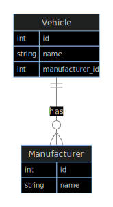
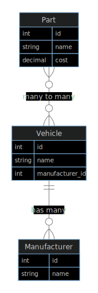
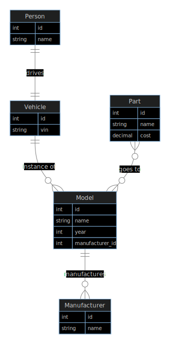

We'll cover three main ideas:

- What is an ORM and why should you be using one?
- How to use GORM
- How does GORM compare to other popular ORMs
  	- Django ORM

---

## What is an ORM?

**Object–relational mapping** is a technique for converting between relational databases and object-oriented programming languages.

| Database | Code |
| --- | --- |
| Table | Class / Model |
| Column | Field / Attribute |
| Relationships | Field / Attribute |

---

## Why use an ORM?

- Typed interaction with your database
- Speed up development time
- Prevent SQL-injection
- Auto migrations
- ➖ Higher level abstraction
- ➖ Can lead to poor performance (N+1)

---

## Relationships

- has one / belongs to
- has many
- many to many
- polymorphism
- single-table inheritance

---

## Demo — Cars

- has one
    - vehicle and driver
- has many
    - vehicle and model
    - model and manufacturer
- many to many
    - model and parts
- polymorphism: gas and electric vehicles
- single-table inheritance

---

## Has many

---

## Many to Many

- When using GORM AutoMigrate, GORM will create join tables automatically

---

## Has one

- Assume one driver to one vehicle

---

## Repository pattern

---

## Active record vs. Data mapper

---

## Resources
