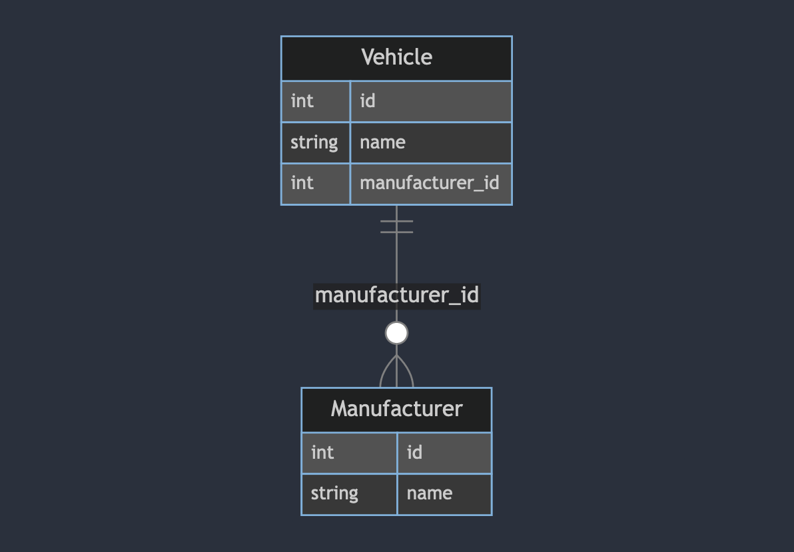
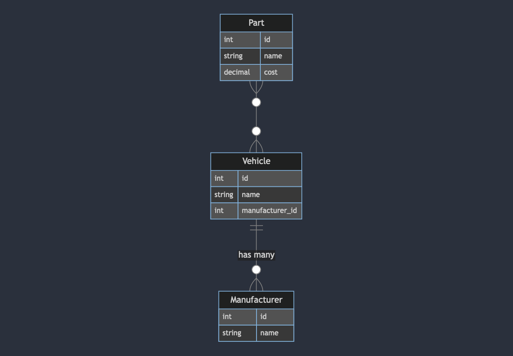
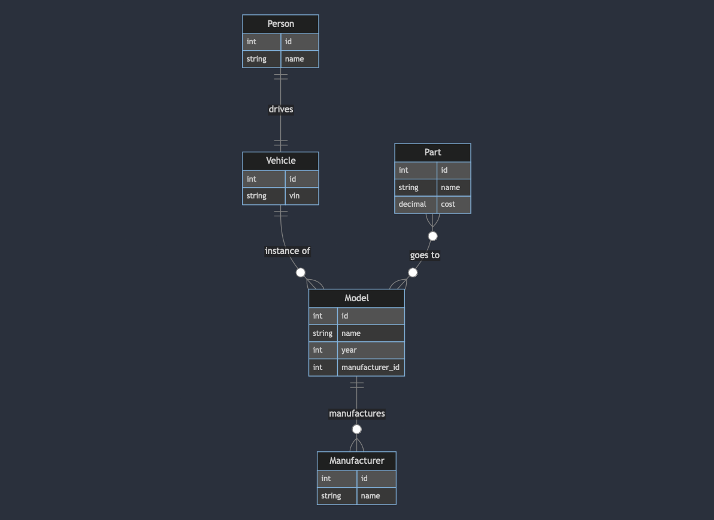

## Exploring GORM: The Fantastic ORM for Go

and the Django ORM for all you Pythonistas

---

## Agenda

We'll cover three main ideas:

- What is an ORM and why should you be using one?
- How to use GORM
- How does GORM compare to other popular ORMs
  	- Django ORM

---

## What is an ORM?

**Object–relational mapping** is a technique for converting between relational databases and object-oriented programming languages.

| Database | Code |
| --- | --- |
| Table | Class / Model |
| Column | Field / Attribute |
| Relationships | Field / Attribute |

---

## Why use an ORM?

- Typed interaction with your database
- Speed up development time
- Prevent SQL-injection
- Auto migrations
- ➖ Higher level abstraction
- ➖ Can lead to poor performance (N+1, etc.)

---

## Relationships

- has one / belongs to
- has many
- many to many
- polymorphism
- single-table inheritance

---

## Demo — Cars

- has one
    - vehicle and driver
- has many
    - vehicle and model
    - model and manufacturer
- many to many
    - model and parts
- polymorphism: gas and electric vehicles
- single-table inheritance

---

## Has many

- A `manufacturer` has many `vehicles`

---

## Many to many

- A `part` can fit many `vehicles` and a `vehicle` can have many `parts`
- When using GORM AutoMigrate, GORM will create join tables automatically

---

## Has one

- A `vehicle` has one driver, a `person`

---

<!-- _class: small -->

## SQL vs. GORM vs. Django ORM functions

| SQL | GORM | GORM Gen | Django |
| --- | --- | --- | --- |
| SELECT * | `db.Select()` | `q.Person.Select()` | `queryset.all()` |
| SELECT name | `db.Select("name")` | `q.Person.Select(q.Person.Name)` | `queryset.values("name")` |
| WHERE name = 'Joe' | `db.Where("name=?","Joe")` | `q.Person.Where( q.Person.Name.Eq("Joe"))` | `queryset.filter(name="Joe")` |
| LIMIT | `.Limit(10)` | `q.Person.Limit(10)` | `qs[:10]` |

---

## Repository pattern

---

## Active record vs. Data mapper

---

## Resources
